# Claude in ANZ: silicon to invoice (Excalidraw, L300–400)

Story C of the [Bedrock Whiteboard](../../bedrock-whiteboard/) deck. These 14 hand-drawn diagrams follow Claude from the training cluster to a prompt typed in Sydney or Auckland. They cover the chips, accelerator anatomy, chip lineups and market share, what's inside one rack, serving vs training scale, how weights reach a Region, prefill and decode, where prompt caching lives, sizing, the Bedrock APIs, data residency across the AU and NZ border, and what a team's usage costs.

| # | Diagram |
|---|---|
| c0 | 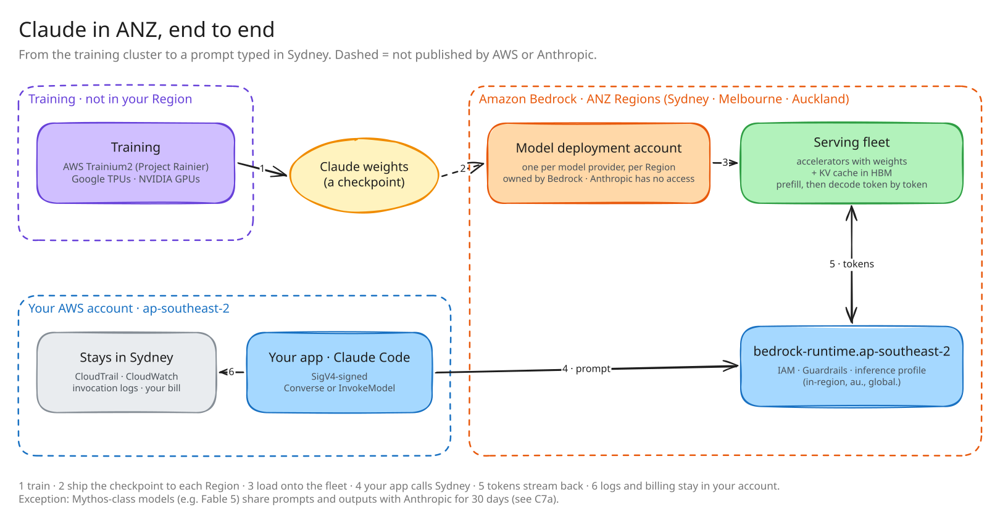 |
| c1 | 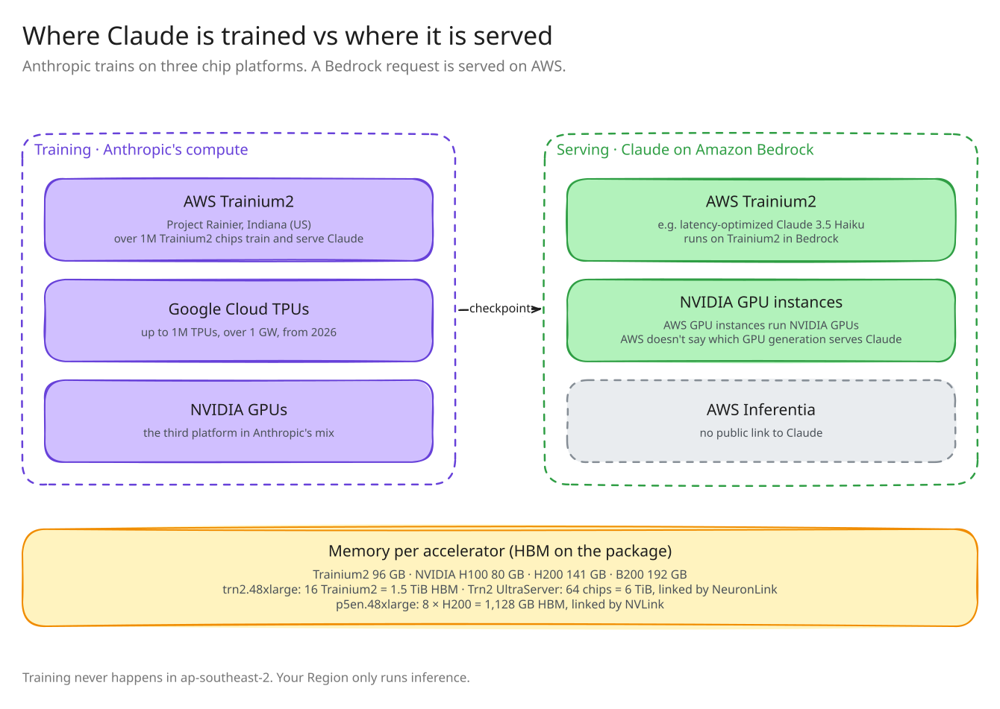 |
| c1a | 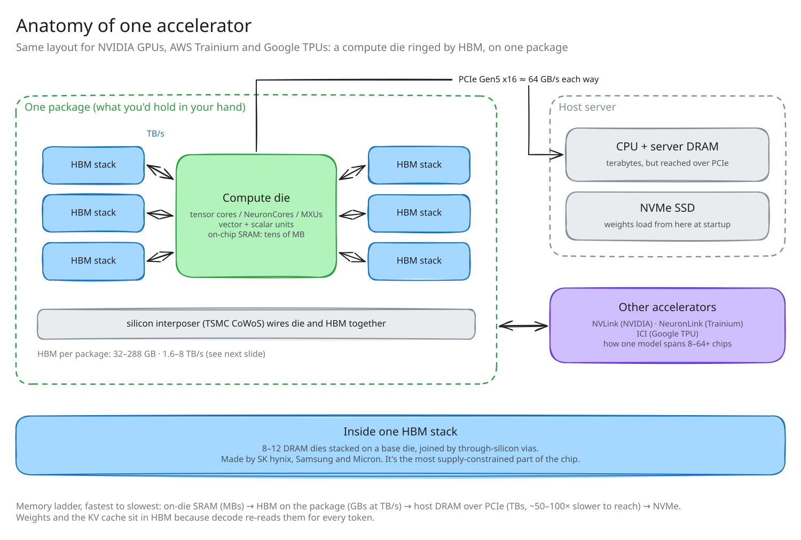 |
| c1b | 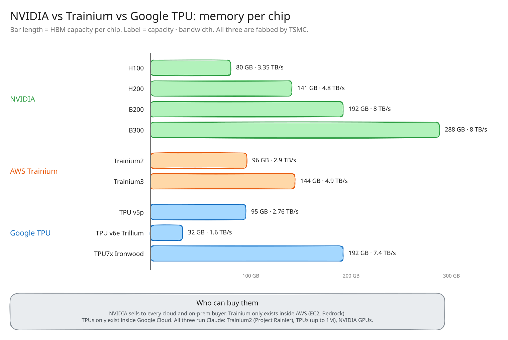 |
| c1c | 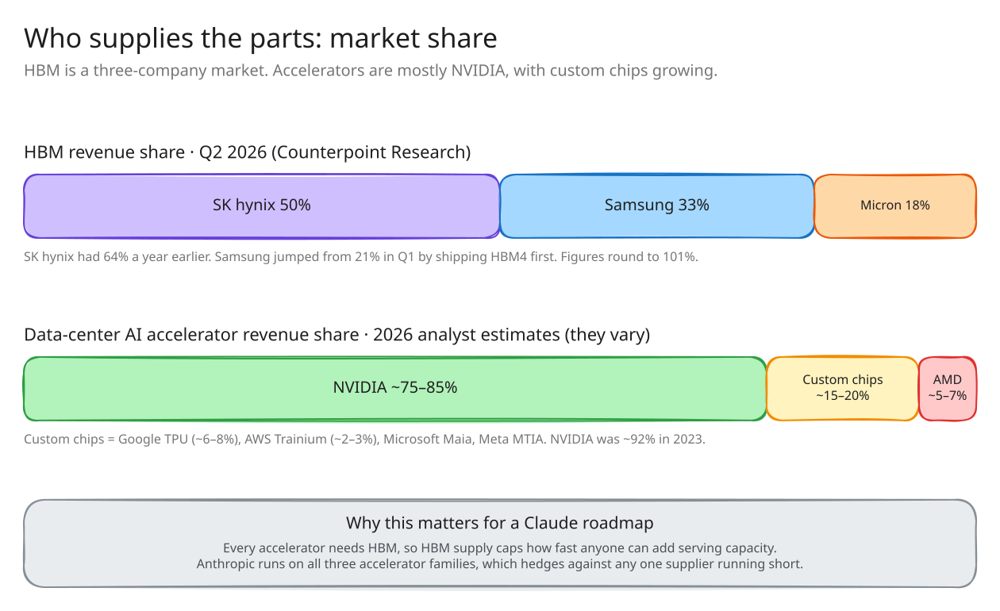 |
| c1d | 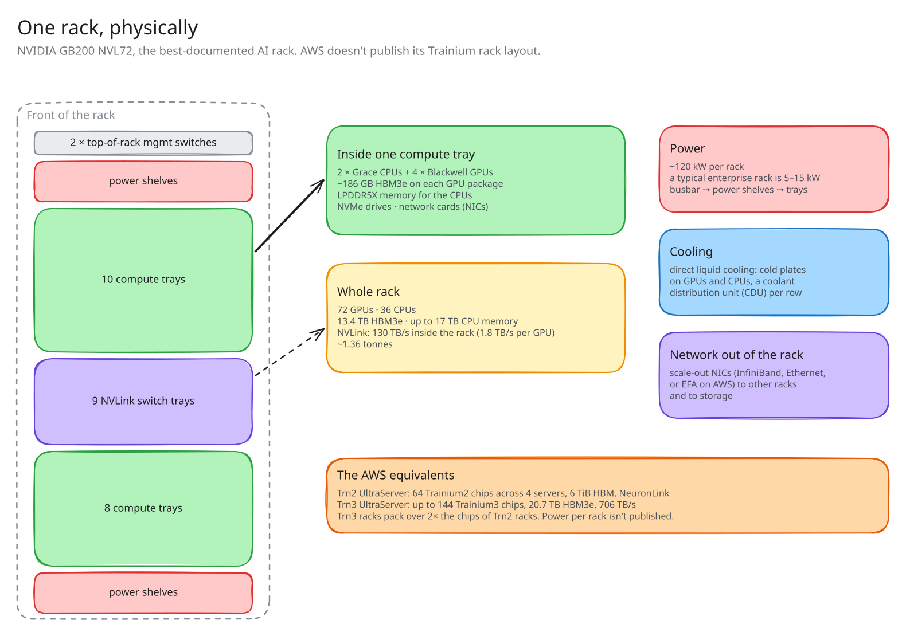 |
| c1e | 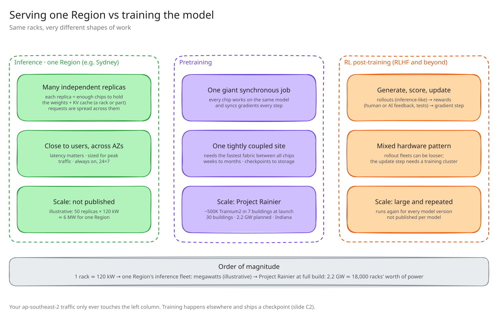 |
| c2 | 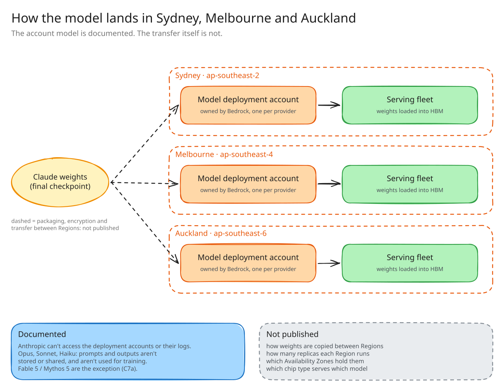 |
| c3 | 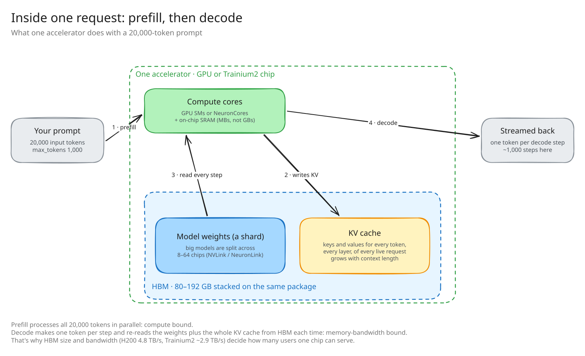 |
| c4 | 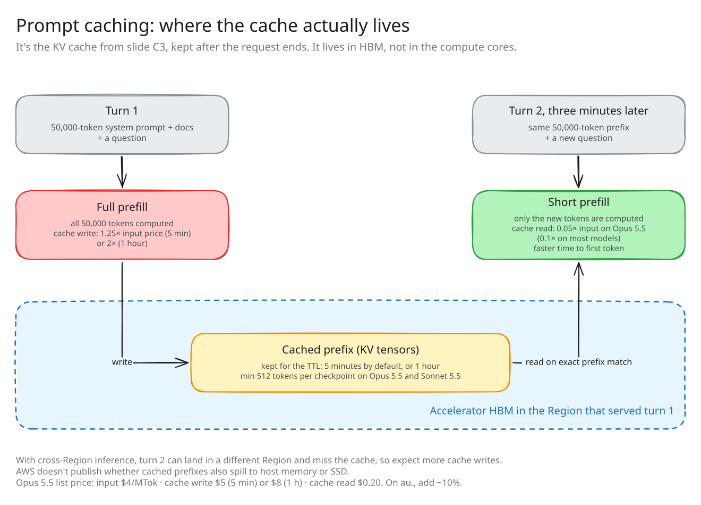 |
| c5 | 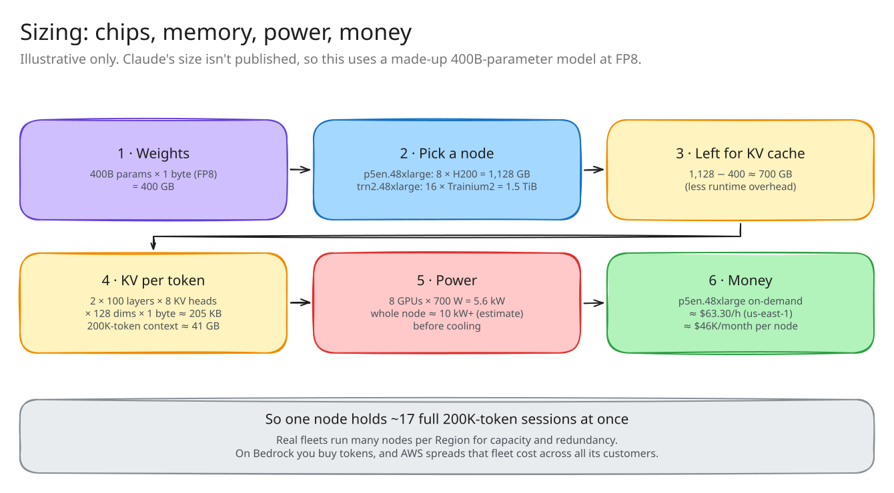 |
| c6 | 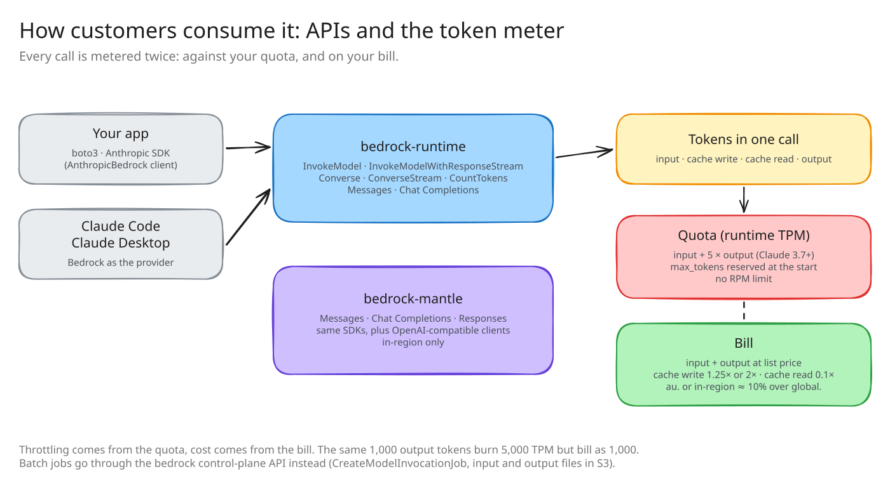 |
| c7 | 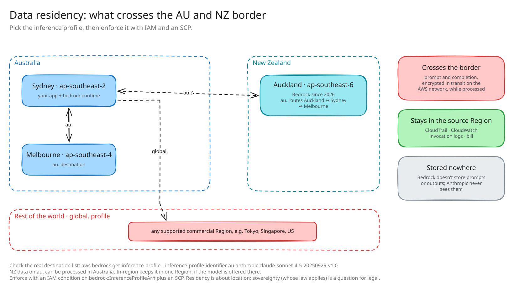 |
| c8 | 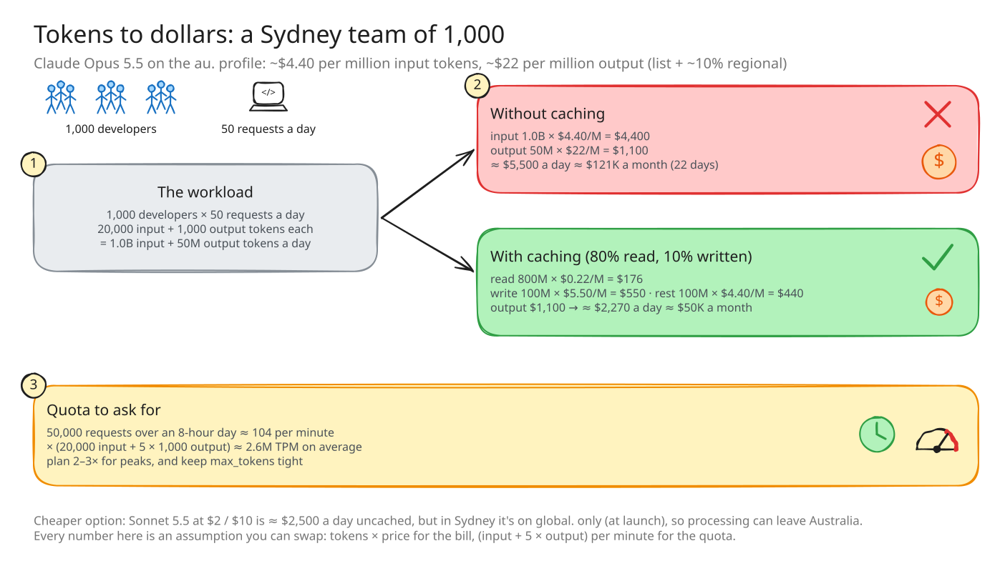 |

## Facts, estimates and unknowns

**Published (checked 2026-10-03)**
- Anthropic trains on three chip platforms: AWS Trainium, Google TPUs and NVIDIA GPUs. Project Rainier (Trainium2, Indiana) trains and serves Claude.
- Latency-optimized Claude 3.5 Haiku on Bedrock runs on Trainium2.
- Bedrock runs one model deployment account per model provider in each Region. Bedrock owns those accounts and providers can't access them. Bedrock doesn't store prompts or outputs, or use them to train models.
- `au.` cross-Region inference routes between Sydney and Melbourne. Since Bedrock launched in Auckland (ap-southeast-6, 2026), the AU geography also covers Auckland.
- Prompt caching on Claude:
  - TTL is 5 minutes, or 1 hour on Sonnet 4.5, Haiku 4.5 and Opus 4.5. Those models need at least 4,096 tokens per checkpoint.
  - A cache write costs 1.25× the input price (5 min) or 2× (1 h). A cache read costs 0.1×.
  - Cross-Region inference can increase cache writes.
- Sonnet 4.5 costs $3.00 / $15.00 per million input / output tokens on `global.`, and $3.30 / $16.50 on `au.`.
- Hardware:
  - Trainium2 has 96 GB HBM per chip. trn2.48xlarge has 16 chips and 1.5 TiB, and a Trn2 UltraServer has 64 chips and 6 TiB.
  - H100 has 80 GB, H200 141 GB and B200 192 GB.
  - p5en.48xlarge (8 × H200) costs about $63.30/h on-demand in us-east-1.

- Chip specs (HBM capacity · bandwidth): H100 80 GB · 3.35 TB/s, H200 141 GB · 4.8 TB/s, B200 192 GB · 8 TB/s, B300 288 GB · 8 TB/s, Trainium2 96 GB · 2.9 TB/s, Trainium3 144 GB · 4.9 TB/s, TPU v5p 95 GB · 2.76 TB/s, TPU v6e 32 GB · 1.6 TB/s, TPU7x Ironwood 192 GiB · 7.37 TB/s.
- HBM revenue share for Q2 2026 (Counterpoint Research): SK hynix 50%, Samsung 33%, Micron 18%. SK hynix had 64% a year earlier.
- GB200 NVL72:
  - 72 Blackwell GPUs and 36 Grace CPUs, in 18 compute trays plus 9 NVLink switch trays.
  - 13.4 TB HBM3e and 130 TB/s of NVLink.
  - About 120 kW, liquid-cooled, about 1.36 t.
- Trn3 UltraServer: up to 144 Trainium3 chips, 20.7 TB HBM3e, 706 TB/s.
- Project Rainier (New Carlisle, Indiana): about 500K Trainium2 chips in 7 buildings at launch. The plan is 30 buildings and 2.2 GW.

**Estimates, labeled on the diagrams**
- c1c: accelerator market share. Analyst estimates vary, so the diagram shows ranges: NVIDIA ~75–85%, custom chips ~15–20%, AMD ~5–7%.
- c1e: one Region's inference fleet size, shown as an illustrative ~6 MW. Not published.
- c5 uses a made-up 400B-parameter model, because Claude's size isn't published. The node power figure (~10 kW) is an estimate.
- c8 uses assumed usage numbers. Swap in your own.

**Not published**
- How weights move between Regions, how many replicas each Region runs, and AZ placement.
- Which chip type serves which Claude model.
- Whether cached prefixes spill out of HBM.

## Sources
- [AWS ML Blog: cross-Region inference in Japan and Australia](https://aws.amazon.com/blogs/machine-learning/introducing-amazon-bedrock-cross-region-inference-for-claude-sonnet-4-5-and-haiku-4-5-in-japan-and-australia/)
- [AWS ML Blog: Amazon Bedrock in Asia Pacific (New Zealand)](https://aws.amazon.com/blogs/machine-learning/run-generative-ai-inference-with-amazon-bedrock-in-asia-pacific-new-zealand/)
- [Bedrock prompt caching](https://docs.aws.amazon.com/bedrock/latest/userguide/prompt-caching.html) · [1-hour cache TTL](https://aws.amazon.com/about-aws/whats-new/2026/01/amazon-bedrock-one-hour-duration-prompt-caching)
- [Bedrock data protection](https://docs.aws.amazon.com/bedrock/latest/userguide/data-protection.html)
- [Trainium2 architecture (Neuron docs)](https://awsdocs-neuron.readthedocs-hosted.com/en/latest/general/arch/neuron-hardware/trn2-arch.html) · [Trn2 launch](https://aws.amazon.com/blogs/aws/amazon-ec2-trn2-instances-and-trn2-ultraservers-for-aiml-training-and-inference-is-now-available)
- [Anthropic: Trainium2 and distillation](https://www.anthropic.com/news/trainium2-and-distillation) · [Anthropic and Amazon compute](https://www.anthropic.com/news/anthropic-amazon-compute)
- [HBM share Q2 2026 (Seoul Economic Daily, citing Counterpoint)](https://en.sedaily.com/finance/2026/09/03/samsung-doubles-hbm-market-share-to-33-percent-narrowing)
- [Accelerator market share estimates](https://introl.com/blog/ai-accelerators-beyond-gpus-tpu-trainium-gaudi-cerebras)
- [Google TPU7x (Ironwood)](https://docs.cloud.google.com/tpu/docs/tpu7x) · [AWS Trn3](https://aws.amazon.com/ec2/instance-types/trn3/)
- [NVIDIA GB200 NVL72](https://www.nvidia.com/en-us/data-center/gb200-nvl72/)
- [Project Rainier campus (DataCenterNews)](https://datacenter.news/story/aws-s-11bn-indiana-data-centre-powers-anthropic-s-ai-growth)
- [p5en.48xlarge pricing](https://aws-pricing.com/p5en.48xlarge.html)

## Rebuilding
Scenes live in `tools/diagrams.js`. Render them with the `excalidraw-story-deck` skill:

```sh
bash .claude/skills/excalidraw-story-deck/scripts/excalidraw/render.sh \
  architecture-diagrams/claude-anz-infra-excalidraw/tools/diagrams.js \
  architecture-diagrams/claude-anz-infra-excalidraw/diagrams
python3 .claude/skills/excalidraw-story-deck/scripts/build.py bedrock-whiteboard
```
