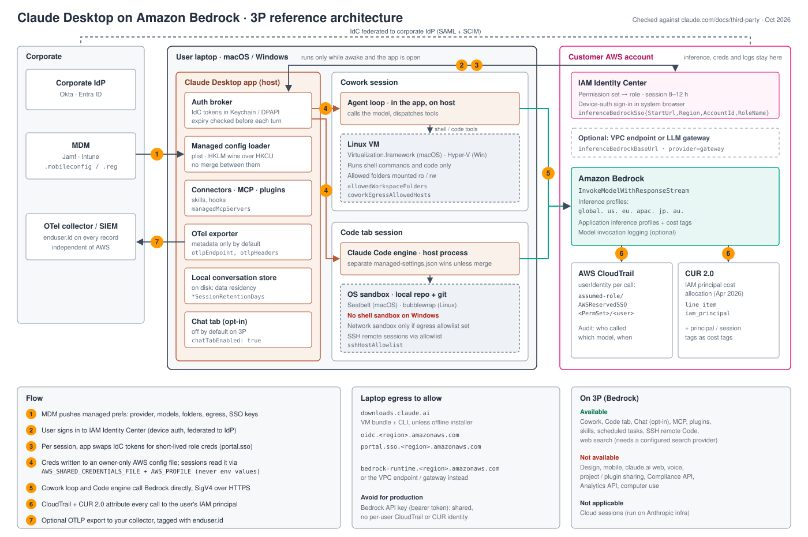

# Claude Desktop on Amazon Bedrock: reference architecture

- `architecture.svg`: editable source
- `architecture.png`: 2800×1860 export for slides
- `story-view.excalidraw`: simple 5-step whiteboard version for explaining the flow. Open it at excalidraw.com (File → Open) and edit live.

### Story view, 5 steps

1. MDM pushes the config to Claude Desktop.
2. The user signs in to IAM Identity Center, which is federated to the corporate IdP.
3. The app gets short-lived AWS creds.
4. Prompts go straight from the laptop to Bedrock in your account.
5. CloudTrail and CUR record every call per user: who, which model, what it cost.

## Changes from the previous diagram

Checked against the docs on 2026-10-03.

| # | Previous claim | Verdict | Correction |
|---|---|---|---|
| 1 | MDM pushes provider, models, folders and sandbox policy | Partial | The mechanism is correct: a plist domain `com.anthropic.claudefordesktop`, or `HKLM`/`HKCU\SOFTWARE\Policies\Claude`. There is no single "sandbox policy" key. Policy is spread across `allowedWorkspaceFolders`, `coworkEgressAllowedHosts`, `blockReadsOutsideWorkingDirectories`, `disabledBuiltinTools` and `builtinToolPolicy`. |
| 2 | User signs in through the corporate IdP | Partial | The user signs in to **IAM Identity Center** (device auth in the system browser), and Identity Center is federated to Okta or Entra. A direct IdP sign-in (`external-idp`) works only behind your own auth proxy, because Bedrock rejects IdP tokens. |
| 3 | App trades an IdP token for STS creds | Reworded | The app keeps the Identity Center tokens in Keychain or DPAPI. At each session start it swaps them for permission-set role creds via `portal.sso`. Keys: `inferenceBedrockSso{StartUrl,Region,AccountId,RoleName}`. |
| 4 | Creds are injected into the Code CLI and the Cowork VM; the Cowork agent harness runs in the VM | **Wrong (Cowork)** | The Cowork **agent loop runs in the app on the host**. The VM (Virtualization.framework or Hyper-V) runs only shell commands and code. Creds go in owner-only AWS config files read via `AWS_SHARED_CREDENTIALS_FILE` and `AWS_PROFILE`, not env values. virtiofs is not documented. |
| 4b | Code tab uses the OS sandbox (Seatbelt, bwrap) | Partial | There is **no shell sandbox on Windows**. The network sandbox applies only if `coworkEgressAllowedHosts` is set. A separate Claude Code `managed-settings.json` wins unless it sets `parentSettingsBehavior: "merge"`. |
| 5 | Calls go direct to Bedrock with SigV4 | Correct | Claude Code uses `InvokeModelWithResponseStream`, not Converse. Models are inference profiles (`global.`, `us.`, `eu.`, `apac.`, `jp.`, `au.`). Optionally, route through a VPC endpoint or LLM gateway. |
| 6 | CloudTrail + CUR give per-user cost | Correct, made specific | CloudTrail `userIdentity` is `AWSReservedSSO_<PermSet>/<user>`. **CUR 2.0 IAM principal cost allocation** (Apr 2026) adds the `line_item_iam_principal` column. A Bedrock API key breaks per-user attribution. |
| 7 | App shell: config, auth, UI, MCP, plugins, skills | Mostly | Added the Cowork and Chat agent loop, the local conversation store (data residency) and the OTel exporter. |
| 8 | Not available on 3P: Chat, cloud sessions, Remote Control, Design, Computer Use | **Wrong (Chat)** | Chat **is** available on 3P, opt-in via `chatTabEnabled`. Not available: Design, mobile, claude.ai web, voice, sharing, Compliance and Analytics APIs, and computer use. Cloud sessions run on Anthropic infra, so they don't apply. Remote Control isn't documented for 3P, so it was dropped. |
| 9 | Runs only while awake and the app is open | Correct | Also applies to scheduled tasks (`keepAwakeEnabled`). |

## Added

- Laptop egress list: `downloads.claude.ai` (unless you use the offline installer), `oidc.<region>`, `portal.sso.<region>`, and `bedrock-runtime` or the VPC endpoint.
- OTel export (`otlpEndpoint`). Every record carries `enduser.id`, so you get per-user telemetry without AWS.
- Set the permission set session to 8–12 h. Each config profile covers one account and one role.

## Sources

- https://claude.com/docs/third-party/claude-desktop/bedrock
- https://claude.com/docs/third-party/claude-desktop/mdm
- https://claude.com/docs/third-party/claude-desktop/code
- https://claude.com/docs/third-party/claude-desktop/feature-matrix
- https://claude.com/docs/third-party/claude-desktop/telemetry
- https://claude.com/docs/third-party/claude-desktop/configuration
- https://code.claude.com/docs/en/amazon-bedrock
- https://support.claude.com/en/articles/14479288 (Cowork architecture)
- https://docs.aws.amazon.com/awsaccountbilling/latest/aboutv2/iam-principal-cost-allocation.html
