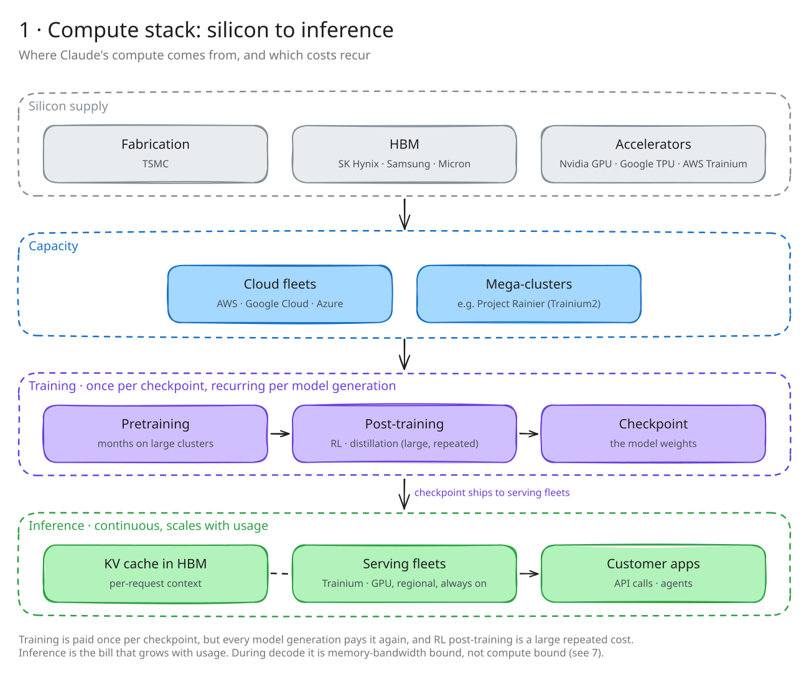
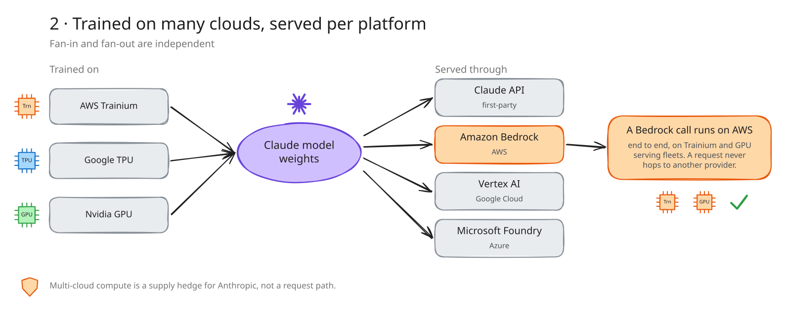
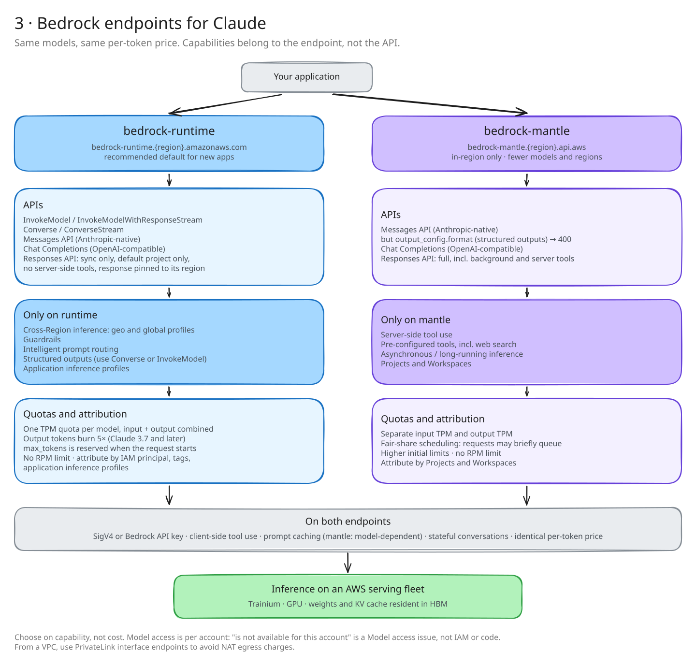
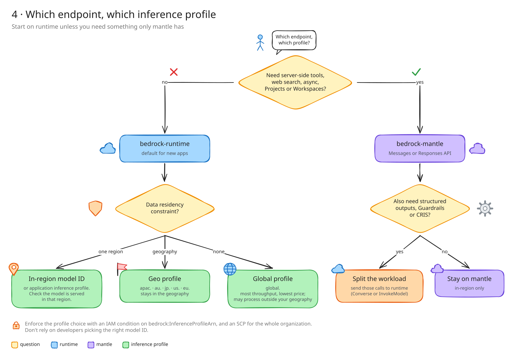
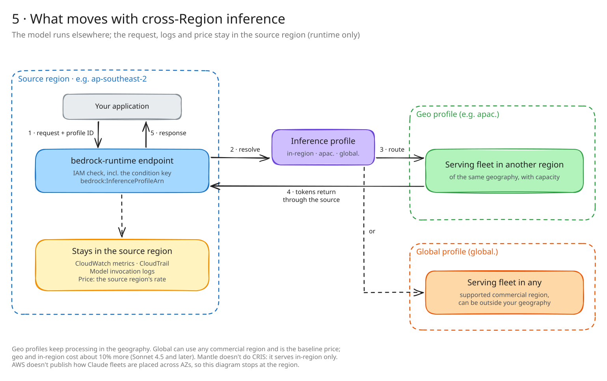
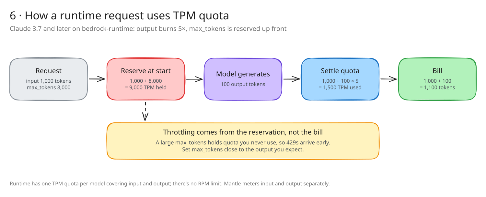
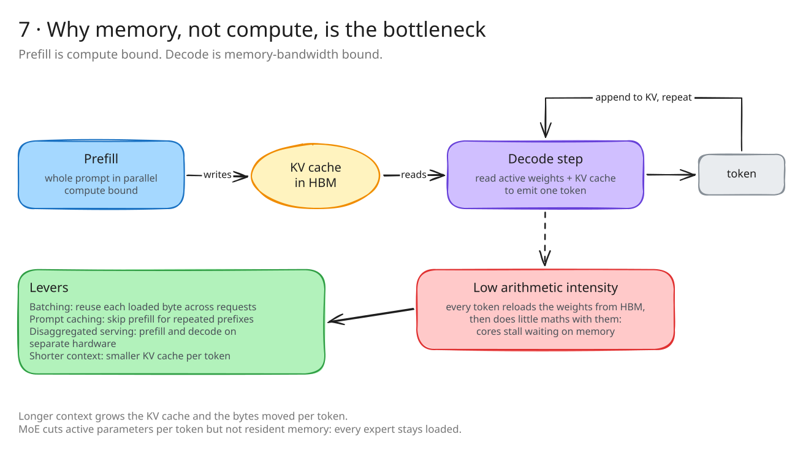

# Architecture: Claude on Amazon Bedrock (Excalidraw)

Hand-drawn Excalidraw version of [`claw-workspace/architecture.md`](https://github.com/bsnehanshu/claw-workspace/blob/master/architecture.md), with the corrections from the 2026-10-03 fact-check in [`../claude-on-bedrock/`](../claude-on-bedrock/) applied.

Each diagram in `diagrams/` comes in three files:

- `*.excalidraw.svg`: renders on GitHub. To edit it, open it in excalidraw.com, since the scene is embedded in the file.
- `*.excalidraw`: the plain Excalidraw scene.
- `*.png`: a 2× export for slides.

---

## 1. Compute stack: silicon to inference



Training is paid once per checkpoint. Every model generation pays it again, and RL post-training is a large repeated cost. Inference is the cost that grows with usage. During decode it's limited by memory bandwidth, not compute (see 7).

## 2. Trained on many clouds, served per platform



Fan-in and fan-out are independent. Multi-cloud compute is a supply hedge, not a request path. A request never hops between providers: a Bedrock call is served on AWS end to end, on Trainium and GPU.

## 3. Bedrock endpoints for Claude



Bedrock has two inference endpoints. The Anthropic Messages API runs on both. They differ in which Bedrock features come with the endpoint. AWS recommends `bedrock-runtime` for new applications.

### API support

| API | `bedrock-runtime` | `bedrock-mantle` |
|---|---|---|
| InvokeModel / InvokeModelWithResponseStream | yes | no |
| Converse / ConverseStream | yes | no |
| Messages API (Anthropic-native) | yes | yes, but no structured outputs |
| Chat Completions (OpenAI-compatible) | yes | yes |
| Responses API (OpenAI-compatible) | sync only, limited | yes, full |

- **Messages on mantle:** `output_config.format` (structured outputs) returns a 400. For structured outputs with Claude, use Converse or InvokeModel on runtime.
- **Responses on runtime:**
  - It's synchronous only: `background=true` returns a 400.
  - Server-side and pre-configured tools aren't available. Client-side tool use works.
  - Only the default project is supported.
  - A stored response is pinned to the Region that served it.

### Inference capabilities

| Capability | `bedrock-runtime` | `bedrock-mantle` |
|---|---|---|
| Cross-Region inference (geo and global profiles) | yes | no, in-region only |
| Guardrails | yes | no |
| Intelligent prompt routing | yes | no |
| Application inference profiles | yes | no |
| Prompt caching | yes | yes, model-dependent |
| Client-side tool use | yes | yes |
| Server-side tool use | no | yes |
| Pre-configured tools (incl. web search) | no | yes |
| Asynchronous / long-running inference | no | yes |
| Stateful conversation management | yes | yes |
| Projects | default project only | yes |
| Workspaces | no | yes |

### Quotas, auth and attribution

| Item | `bedrock-runtime` | `bedrock-mantle` |
|---|---|---|
| Auth | SigV4 or Bedrock API key | SigV4 or Bedrock API key |
| Throughput quota | One TPM quota per model, input + output combined. No RPM limit. | Separate input and output TPM, with fair-share scheduling. Requests may briefly queue. Higher initial limits. No RPM limit. |
| Output burndown | 5× for Claude 3.7 and later, and `max_tokens` is reserved at request start (see 6) | n/a |
| Usage attribution | IAM principal, request metadata tags, application inference profiles | Projects, Workspaces |
| Model and Region coverage | Broadest | Fewer models and Regions |
| Per-token price | Same on both | Same on both |

Pricing is the same on both endpoints, so choose based on capability, not cost. If you see `is not available for this account`, that's a Model access problem, not code or IAM. From a VPC, use PrivateLink interface endpoints to avoid NAT egress charges.

## 4. Which endpoint, which inference profile



| Profile | Routing scope | Trade-off |
|---|---|---|
| In-region | One Region | Strictest residency, lowest throughput. Check that the model is served there. |
| Geo (`apac.` `au.` `jp.` `us.` `eu.`) | A Region within the geography | More throughput, and processing stays in the geography |
| Global (`global.`) | Any supported commercial Region | Most throughput and the baseline price. Geo and in-region cost about 10% more (Sonnet 4.5 and later). Processing can leave your geography. |

Enforce the choice with an IAM condition on `bedrock:InferenceProfileArn`, plus an SCP across the organization. Mantle uses short model IDs with no profile prefix, e.g. `anthropic.claude-opus-5-5`.

## 5. What moves with cross-Region inference



This replaces the original "regional serving topology" diagram:

- With CRIS, the model runs in a destination Region, but the request still enters and returns through the source Region.
- CloudWatch, CloudTrail, invocation logs and the price stay with the source Region.
- AWS doesn't publish how Claude fleets are placed across AZs, so the per-AZ "weights resident in each AZ" picture was dropped.

## 6. How a runtime request uses TPM quota



Throttling comes from the reservation, not the bill. Set `max_tokens` close to the output you expect.

## 7. Why memory, not compute, is the bottleneck



During autoregressive decode, the accelerator reads all active weights plus the KV cache from HBM to produce one token, then does relatively little arithmetic with them.

- Batching raises arithmetic intensity by reusing each loaded byte across more requests.
- Prefill is compute bound and decode is memory bound, which is why serving gets disaggregated.
- Longer context grows the KV cache and the bytes moved per token.
- MoE reduces active parameters per token but not resident memory: every expert stays loaded.

---

## What changed from the original

| Original claim | Now |
|---|---|
| Runtime has "fixed per-account RPM/TPM quotas" | AWS stopped enforcing RPM on both endpoints in May 2026. Runtime has one per-model TPM; mantle has separate input and output TPM. |
| Response "stays in region unless CRIS" | With CRIS, the request and response still pass through the source Region. Only the model runs elsewhere. |
| Per-AZ fleets with weights in each AZ | Not published by AWS, so it's dropped |
| Custom silicon: Trainium, Inferentia | Claude on Bedrock is served on Trainium and GPU. There's no public link between Inferentia and Claude. |
| Training is a one-time cost | It's one-time per checkpoint but recurs every model generation |
| Features hang off individual APIs | Capabilities belong to the endpoint. The exception is mantle Messages rejecting `output_config.format`. |
| Global CRIS "~10% cheaper" | Global is the baseline price; geo and in-region cost about 10% more (Sonnet 4.5 and later) |
| Not covered | Quota burndown (5× output, `max_tokens` reservation); mantle's limited model and Region coverage |

Not covered yet: Reserved tier, Provisioned Throughput and batch inference.

Endpoint capabilities change often. Check them against the [Bedrock endpoints page](https://docs.aws.amazon.com/bedrock/latest/userguide/endpoints.html) before using this with customers. Full source list: [`../claude-on-bedrock/README.md`](../claude-on-bedrock/README.md#sources).

## Rebuilding

The scenes are generated from `tools/diagrams.js`, so edit there rather than hand-moving boxes. You can still edit any `.excalidraw.svg` directly in excalidraw.com.

```sh
cd tools && npm i
npx esbuild entry.js --bundle --format=iife --outfile=bundle.js --loader:.woff2=file --loader:.css=empty --define:process.env.NODE_ENV='"production"' --minify
(python3 -m http.server 8765 &) && node export.mjs ../diagrams
```
