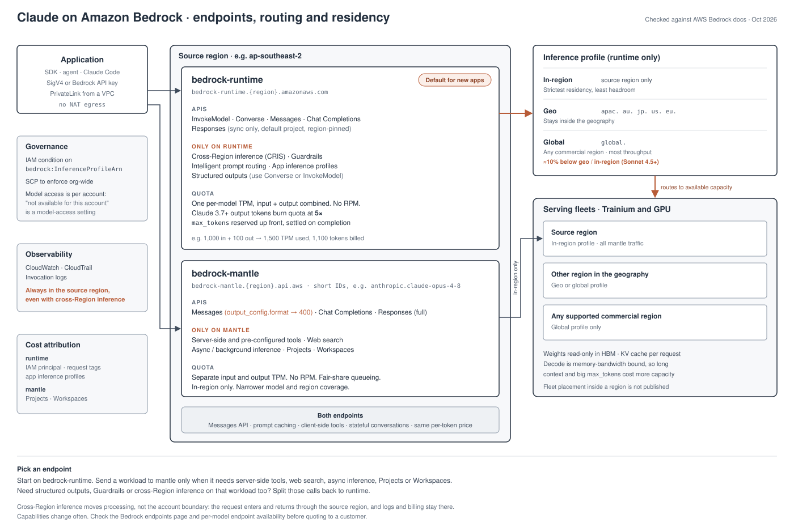
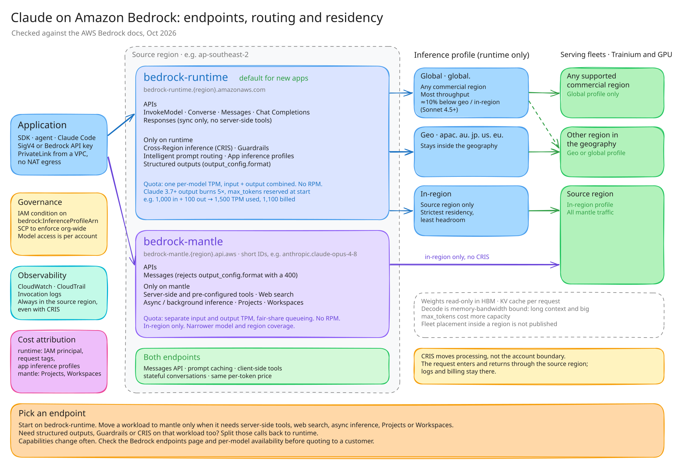

# Claude on Amazon Bedrock: endpoints, routing and residency

- `architecture.svg`: editable source (hand-drawn, same style as `claude-desktop-bedrock`)
- `architecture.png`: 2800×1860 export for slides
- `architecture.excalidraw.svg`: the same diagram as a hand-drawn Excalidraw version. GitHub renders it, and excalidraw.com can open it for editing because the scene is embedded in the SVG.
- `architecture.excalidraw`: the same scene as a plain Excalidraw file
- `architecture.excalidraw.png`: 2800×1901 export of the Excalidraw version for slides
- `diagrams/`: supporting diagrams. Each has a `.mmd` Mermaid source, a `.svg` and a 3× `.png` for slides. Rebuild with `npx -p @mermaid-js/mermaid-cli mmdc -i <file>.mmd -o <file>.png -s 3 -b white`.

| File | Shows |
|---|---|
| `diagrams/1-compute-stack` | Silicon → capacity → training (per generation) → inference |
| `diagrams/2-distribution` | Trained on Trainium, TPU and GPU; served on Claude API, Bedrock, Vertex AI, Foundry |
| `diagrams/3-pick-endpoint` | Decision tree: runtime vs. mantle, then inference profile by residency |
| `diagrams/5-cris-path` | What moves with cross-Region inference, and what stays in the source region |
| `diagrams/6-quota-burndown` | Runtime TPM reservation and 5× output burndown, with numbers |
| `diagrams/7-decode` | Why decode is memory-bandwidth bound, and the levers |

### Excalidraw version

## Changes from the previous diagram

Source: `bsnehanshu/claw-workspace/architecture.md`. Checked against the AWS docs on 2026-10-03.

| # | Previous claim | Verdict | Correction |
|---|---|---|---|
| 1 | Runtime throughput is "fixed per-account RPM/TPM quotas" | **Wrong (stale)** | AWS stopped enforcing RPM on both endpoints (doc update 27 May 2026). Runtime has one per-model TPM covering input and output. Mantle has separate input and output TPM with fair-share queueing. |
| 2 | Regional topology: "response stays in region unless CRIS" | **Wrong** | With CRIS the model runs in a destination region, but the request enters and returns through the source region. CloudWatch, CloudTrail, invocation logs and pricing stay with the source region. Replaced by `5-cris-path`. |
| 3 | Per-AZ serving fleets with weights resident in each AZ | Unverified | AWS doesn't publish fleet placement for Claude. Dropped from the main diagram, noted as unpublished. |
| 4 | Custom silicon: Trainium, Inferentia | Partial | No public link between Inferentia and Claude. Claude on Bedrock is served on Trainium and GPU. |
| 5 | Training is a one-time cost | Reworded | One-time per checkpoint, recurring per model generation. RL post-training is a large, repeated cost. |
| 6 | Endpoint features hang off individual APIs | Redrawn | Capabilities belong to the endpoint. API exception: Mantle Messages rejects `output_config.format` with a 400. |
| 7 | Global CRIS is "~10% cheaper" | Correct, reframed | Applies to Sonnet 4.5 and later. AWS treats global as the baseline; geo and in-region cost about 10% more. Pricing follows the source region. |
| 8 | Runtime recommended for new apps; Messages API on both endpoints | Correct | Matches current AWS guidance. |
| 9 | Responses API on runtime: sync only, default project, region-pinned | Correct | `background=true` returns a 400. No server-side tools. |
| 10 | CRIS, Guardrails, prompt routing runtime-only; server tools, web search, async, Projects, Workspaces mantle-only | Correct | |
| 11 | Same per-token price on both endpoints | Correct | Pick on capability, not cost. |
| 12 | IAM on `bedrock:InferenceProfileArn`; logs stay in source region | Correct | Add an SCP for org-wide enforcement. |
| 13 | Mantle short IDs, e.g. `anthropic.claude-opus-5-5` | Correct | Opus 4.8 GA 28 May 2026. |

## Added

- Quota burndown on runtime: Claude 3.7+ output tokens count 5× against TPM, and `max_tokens` is reserved when the request starts. Example: 1,000 in + 100 out uses 1,500 TPM but bills 1,100 tokens.
- Mantle covers fewer models and regions, and serves in-region only.
- Governance and cost attribution per endpoint: IAM principal, tags and app inference profiles on runtime; Projects and Workspaces on mantle.
- Not covered yet: Reserved tier, Provisioned Throughput and batch inference. Check per-model support before adding.

## Companion file

`claw-workspace/architecture-weights-lifecycle.md` has two claims to soften:

- "Temperature 0 is deterministic": output can still vary between runs in practice.
- "Haiku-class models are typically distilled": Anthropic hasn't disclosed this.

## Sources

- https://docs.aws.amazon.com/bedrock/latest/userguide/endpoints.html
- https://docs.aws.amazon.com/bedrock/latest/userguide/inference-messages-api.html
- https://docs.aws.amazon.com/bedrock/latest/userguide/claude-messages-structured-outputs.html
- https://docs.aws.amazon.com/bedrock/latest/userguide/bedrock-mantle.html
- https://docs.aws.amazon.com/bedrock/latest/userguide/quotas-runtime.html
- https://docs.aws.amazon.com/bedrock/latest/userguide/quotas-mantle.html
- https://docs.aws.amazon.com/bedrock/latest/userguide/quotas-token-burndown.html
- https://docs.aws.amazon.com/bedrock/latest/userguide/global-cross-region-inference.html
- https://docs.aws.amazon.com/bedrock/latest/userguide/model-card-anthropic-claude-opus-4-8.html

AWS doc pages couldn't be fetched directly from the build session. Facts were confirmed through search results quoting those pages. Re-check before quoting to a customer.
